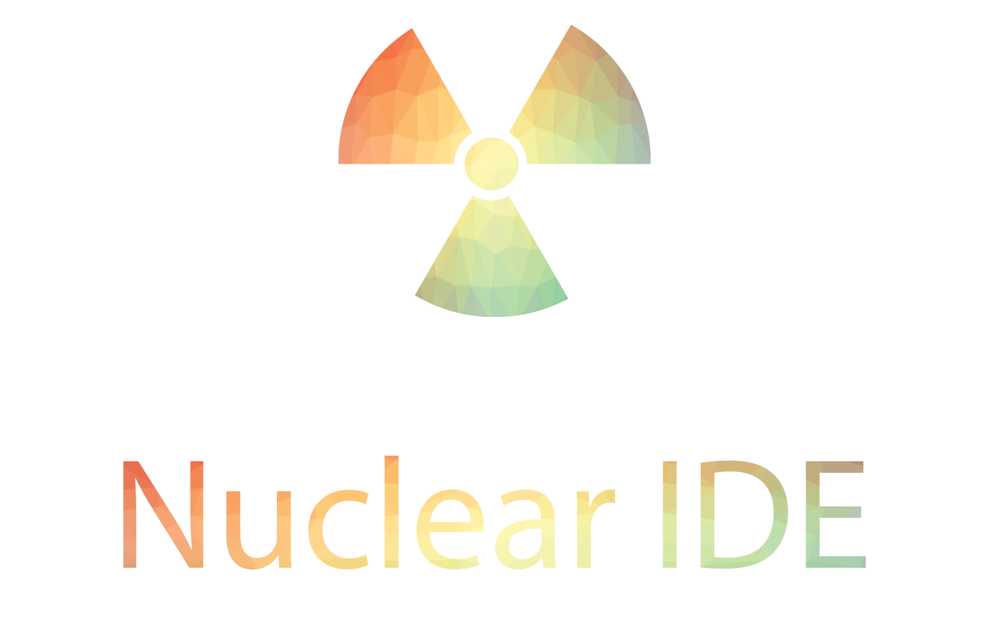

<div align="center">
    <h1>A Modern IDE for JavaScript</h1>
</div>

## Setup

Clone the repository

```bash
$ yarn
$ yarn dev-start
```

## Contributing

[Join Our Discord Server](https://discord.gg/GznHhkA)

Project by Simon Hochrein and the Nuclear IDE contributors.
